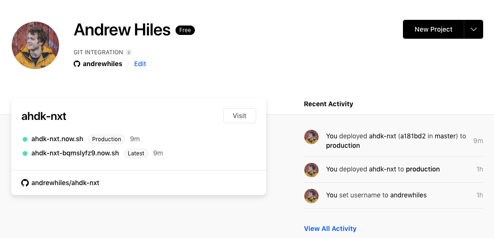

 

# QuantumConf (React w/ Next application)

A basic bare-bones web application built using React and Next.js. Created solely for demo purposes to highlight some of the capabilities of using Next.js.

## Getting Started

These instructions will get you a copy of the project up and running on your local machine for development and testing purposes.

### Prerequisites

You will need the following installed on your machine:

```
Node 6 or above
NPM 3 or above
```

### Installing

Run the following command from inside your project directory and you should be good to go:

```
npm install
```

## Deployment

Next apps can be deployed as fully-serverless offerings 🙌. Yay...Serverless hype!

Providing you have kept the NPM script task 'build' in your package.json file, you should be able to deploy the application within minutes to Zeit.

First, sign-up for an account with Zeit at https://zeit.co/

After signing up, link your github profile to the Zeit account (Zeit's sign-up wizard takes you through all of this).

Finally, associate your nextjs project with Zeit and deploy via the Zeit console.

 

## Authors

* **Andrew Hiles** - *Initial work* - [github link](https://github.com/andrewhiles)
* **David Kelly** - *Initial work* - [github link](https://github.com/dkelly93)